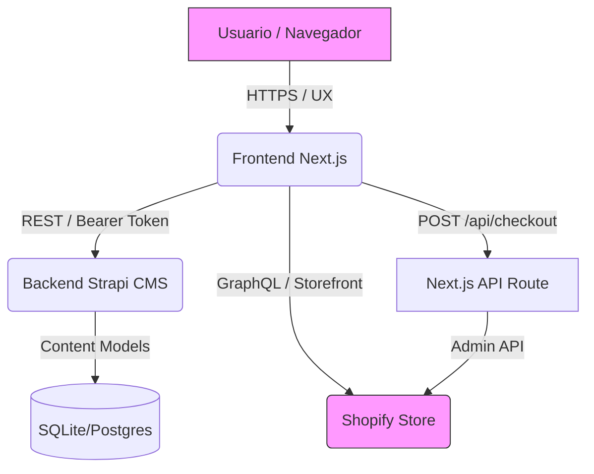

# E-Commerce Project Documentation

Este repositorio es una tienda en línea construida con una arquitectura de frontend/ backend moderna.

## Estructura general

- `frontend/`: aplicación de interfaz basada en Next.js 16 + React 19.
- `backend/`: aplicación Strapi 5 que actúa como CMS y capa de API personalizada.

## Stack tecnológico

| Capa | Tecnología | Descripción |
|---|---|---|
| Frontend | Next.js 16, React 19, Zustand, Zod | App Router, Server Components y cliente interactivo para carrito y filtros |
| Backend | Strapi 5, PostgreSQL/SQLite (configurable), `@strapi-community/shopify` | CMS headless con contenido personalizado y datos de productos Shopify |
| Integración | Admin API | Creación de checkout y uso de product custom field de Shopify |
| Testing | Playwright | Pruebas E2E para flujo de productos, carrito y checkout |

## Enfoque arquitectónico

Este proyecto utiliza un patrón cliente-servidor híbrido:

- `frontend/` consume contenidos del CMS Strapi y hace renderizado en Next.js.
- `backend/` es Strapi, responsable de contenidos, modelos y acceso a datos.
- La capa de comercio electrónico usa Shopify como origen de producto y checkout.

### Principios clave

- Separación de responsabilidades: UI y navegación en `frontend`, contenido y APIs de datos en `backend`.
- Fetching de datos en el servidor con caché de página (`unstable_cache`).
- Estado local de carrito administrado con Zustand y persistencia en `localStorage`.
- Validación de entradas usando `Zod` dentro de rutas API.
- Uso de Strapi como CMS headless con modelos personalizados para `home`, `barra-de-navegacion` y `product-shopify`.

## Diagrama arquitectónico



## Componentes principales

### Frontend

- `frontend/app/`: capas de página y routing App Router.
- `frontend/ui/`: componentes visuales reutilizables.
- `frontend/services/getComponentsFromStrapi.ts`: fetch de datos Strapi con caché.
- `frontend/app/api/checkout/route.ts`: ruta API para crear pedidos de checkout en Shopify Admin.
- `frontend/context/cartStore.ts`: estado del carrito con `zustand` y persistencia.
- `frontend/hooks/useFilters.ts`: gestión de filtros URL y scroll.

### Backend

- `backend/src/api/`: APIs Strapi definidas por contenido.
- `backend/src/api/home/`: modelo `home` y su endpoint.
- `backend/src/api/barra-de-navegacion/`: modelo de navegación.
- `backend/src/api/product-shopify/`: custom field Shopify para productos.
- `backend/config/server.ts`: configuración de host/puerto y claves de app.
- `backend/config/database.ts`: configuración de base de datos con soporte SQLite, Postgres y MySQL.

## Flujo de datos

1. El usuario entra en el sitio y Next.js renderiza páginas con datos fetchados de Strapi.
2. `frontend/services/getComponentsFromStrapi.ts` solicita `home`, `barra-de-navegacion` o `product-shopifies` a Strapi.
3. La página de productos carga `product-shopifies` y obtiene variantes extraídas del custom field Shopify.
4. El carrito se maneja en el cliente con `Zustand` y persiste en el navegador.
5. El checkout invoca `/api/checkout` y crea un draft order en Shopify.

## Validación y calidad

- `frontend/app/api/checkout/route.ts` valida `lineItems` con Zod.
- El frontend mantiene tipos TypeScript en `frontend/types/strapiApiResponses.ts`.
- `unstable_cache` se usa para reducir llamadas a Strapi y mejorar rendimiento.
- Las pruebas de Playwright están en `frontend/tests/`.

## Comandos de desarrollo

### Frontend

```bash
cd frontend
npm install
npm run dev
```

### Backend

```bash
cd backend
npm install
npm run dev
```

### Pruebas E2E

```bash
cd frontend
npm run test:e2e
```

## Variables de entorno

| Variable | Uso | Ubicación |
|---|---|---|
| `STRAPI_API_URL` | URL pública de Strapi | `frontend/services/getComponentsFromStrapi.ts` |
| `STRAPI_API_TOKEN` | Token para API Strapi | `frontend/services/getComponentsFromStrapi.ts` |
| `SHOPIFY_STORE_DOMAIN` | Dominio Shopify | `frontend/lib/shopify.ts` y `frontend/app/api/checkout/route.ts` |
| `SHOPIFY_API_ADMIN_ACCESS_TOKEN` | Token Admin | `frontend/app/api/checkout/route.ts` |
| `DATABASE_CLIENT` | Base de datos Strapi | `backend/config/database.ts` |
| `DATABASE_URL` / `DATABASE_HOST` | Conexión DB | `backend/config/database.ts` |
| `APP_KEYS` | Claves de Strapi | `backend/config/server.ts` |

## Deployment

- `frontend/` está preparado para Netlify con `netlify.toml`.
- `backend/` es una app Strapi que puede desplegarse en cualquier plataforma Node compatible.
- El frontend publica `.next` y usa funciones Netlify desde `.next/server`.

## Extensibilidad

- Nuevas páginas deben agregarse en `frontend/app/` siguiendo App Router.
- Nuevos endpoints de contenido se agregan en `backend/src/api/` como nuevos content-types Strapi.
- Las futuras integraciones de datos deben usar servicios centrales (`frontend/services/` y `frontend/lib/`).

## Archivos de documentación

- `frontend/README.md`
- `backend/README.md`
